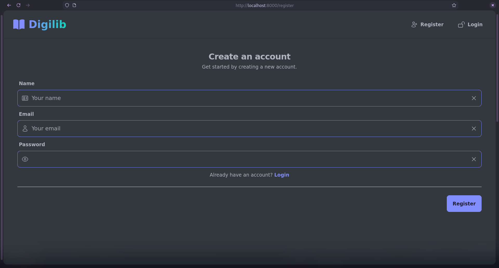
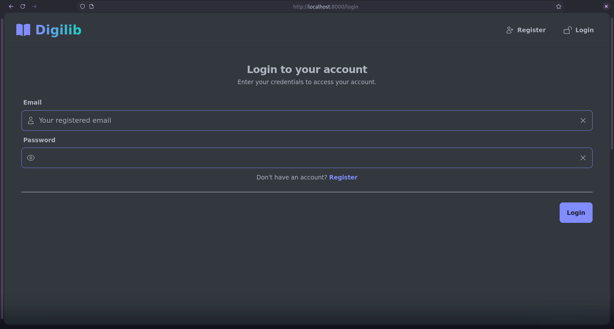

# Digilib

Basic digital library web application with user
authentication and authorization, book management,
and book export features. Built with [TALL stack](https://tallstack.dev/).

This is a back-end developer skill test assignment
for the Back-end Developer position at CTARSA Foundation,
part of the [detik.com](https://www.detik.com/)'s
Kampus Merdeka Batch 7 internship program.

## Project Requirements

For the details of the project requirements,
please refer to the [REQUIREMENTS.md](REQUIREMENTS).

## Tech Stack

-   [Laravel 11](https://laravel.com/)
-   [Livewire](https://livewire.laravel.com/)
-   [Tailwind CSS](https://tailwindcss.com/)
-   [MaryUI](https://mary-ui.com/)
-   [Laravel Excel](https://laravel-excel.com/)
-   [MySQL 8](https://www.mysql.com/)

## Getting Started

1. Ensure you have PHP 8.3 or later and the latest lts version of Node.js installed:

    ```bash
    php -v && node -v
    ```

2. Create a copy of the `.env.example` file and rename it to `.env`:

    ```bash
    cp .env.example .env
    ```

    Update configuration values as needed.

3. Install all dependencies, run docker compose,
   create database schema, and run database migrations:

    ````bash
    composer install
    npm install
    php artisan key:generate
    docker compose up -d
    php artisan migrate
    php artisan db:seed
    ```

    ````

4. Run the project in development mode:

    ```bash
    php artisan serve
    ```

    and on other terminal:

    ```bash
    npm run dev
    ```

Open your browser and visit `http://localhost:8000`.

## Screenshots





## License

Digilib project is licensed under the [MIT License](LICENSE),
providing an open and permissive licensing approach for further development and usage.
